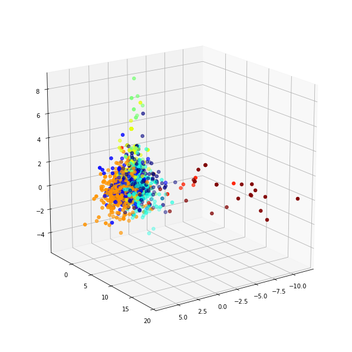
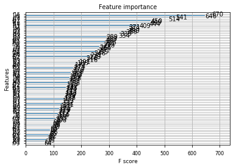
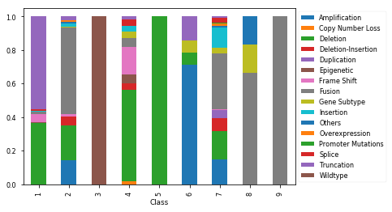
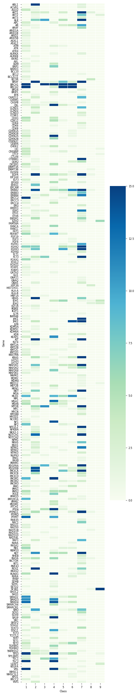

# mskcc_kaggle
Kaggle Competition "Personalized Medicine: Redefining Cancer Treatment" sponsored by Memorial Sloan-Kettering Cancer Center (MSKCC).
https://www.kaggle.com/c/msk-redefining-cancer-treatment

My analyses and exploration of the dataset are included in this repository. The task was a multi-class classification of clinical texts that describe various cancer cases. The goal is to classify each case into a category of cancers.

*I wrote those codes for my own learning purpose and abide by the code/data sharing rules of the competition* (https://www.kaggle.com/c/msk-redefining-cancer-treatment/rules)

<b>Image Gallery</b> 
<i>PCA</i> 

 
<i>Feature Importances from a Tree Classifier</i> 

 
<i>Distribution of differen types</i> 

 

<i>Heatmap</i> 

 
